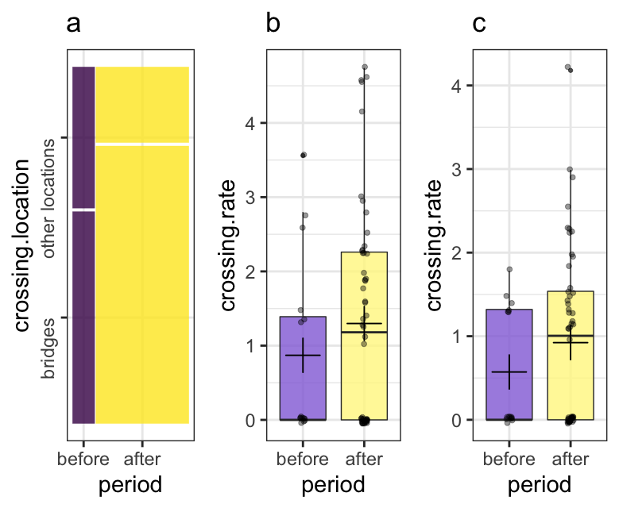

# gibbons-crossing-bridges
data and analyses used in the study "Movement dynamics of gibbons after the construction of canopy bridges over a park road"

    

*Gibbons (Hylobates lar) crossing the road after the canopy bridges were installed An adult female (a) crosses first, followed by a juvenile (b) and an adult male (c).* 

    

*Mosaic plot of crossing frequencies (a) before and after the bridges were set at bridges and at other crossing locations, each rectangle is proportional to the number of cases in that cell. Comparison of crossing rates before and after setting the rope bridge at all crossing location (b) and at bridge locations (c). The horizontal line within boxes indicate the median, the dots are individual points and the crosses are the mean values. The boundary of the box closest to 0 indicates the 25th percentile (first quartile), and the boundary of the box farthest from zero indicates the 75th percentile (fourth quartile). The whiskers denote the minimum and maximum values.* 
